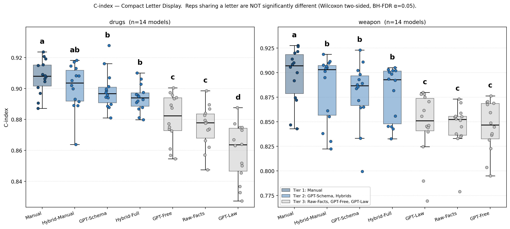
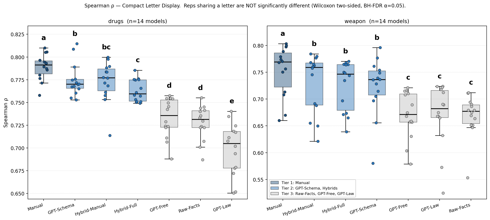
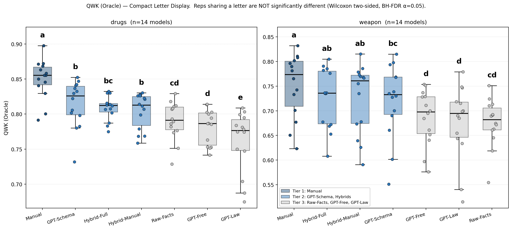
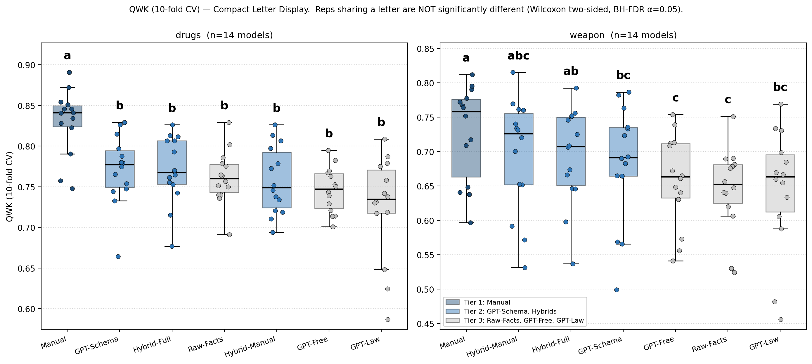

# Ordinal Evaluation of Representations — Final Results

_Updated 2026-04-27. 14-model panel × 7 representations × 2 domains (drugs, weapon)._

## 1. Setup

We evaluate seven representations of criminal verdicts on a 1–3 ordinal similarity scale. Each (representation, model) cell scores 100 (drugs) or 141 (weapon) verdict pairs against expert-annotated ground truth.

**Representations** (7 total):

| Tier | Representation | Description |
|---|---|---|
| 1 | **Manual** | Expert-engineered structured features |
| 2 | **GPT-Schema** | LLM-extracted features in a fixed schema |
| 2 | **Hybrid-Manual** | Manual features + LLM-derived concepts |
| 2 | **Hybrid-Full** | Manual features + full LLM-extracted GPT vector |
| 3 | **GPT-Free** | LLM extraction with free-form schema |
| 3 | **GPT-Law** | LLM extraction with legal-statute schema |
| 3 | **Raw-Facts** | Indictment facts (unstructured text) |

**Models** (14 LLMs spanning seven providers/labs):
GPT-4, GPT-5-Mini, GPT-5.1-Thinking, GPT-5.2, Claude Sonnet 4.6, Gemini 2.5 Pro, Gemini 3 Flash, Gemma 3 27B, Gemma 4 31B, Llama 3 70B, Qwen 3 VL 235B, Qwen 3 235B Instruct, Mistral Large 2411, DeepSeek R1.

**Metrics** (4 ordinal):

| Metric | Type | Description |
|---|---|---|
| QWK (Oracle) | threshold-based | Quadratic Weighted Kappa with optimal class boundaries |
| QWK (10-fold CV) | threshold-based | QWK with held-out cross-validated thresholds |
| C-index | threshold-free | Concordance: P(score_i > score_j \| GT_i > GT_j) |
| Spearman ρ | threshold-free | Rank correlation between scores and GT |

**Significance:** one-sided Wilcoxon signed-rank paired across the 14 models, BH-FDR corrected.

---

## 2. Headline Result

**48 / 48 comparisons where Manual is significantly better** (4 metrics × 2 domains × 6 alternatives, all FDR-corrected p < 0.05).

Manual significantly outperforms every alternative representation on every ordinal metric in both domains. The result holds uniformly across threshold-based (QWK) and threshold-free (C-index, Spearman) metrics.

---

## 3. Mean ± SD per representation (Table 8)

| Rep | QWK Oracle drugs | weapon | Spearman ρ drugs | weapon | Ordinal AUC drugs | weapon |
|---|---|---|---|---|---|---|
| **Manual** | **.850** ±.03 | **.751** ±.06 | **.789** ±.01 | **.753** ±.05 | **.937** ±.01 | **.916** ±.03 |
| GPT-Schema | .814 ±.03 | .720 ±.07 | .775 ±.02 | .723 ±.05 | .929 ±.01 | .899 ±.03 |
| Hybrid-Manual | .804 ±.02 | .725 ±.07 | .773 ±.02 | .729 ±.05 | .928 ±.01 | .902 ±.03 |
| Hybrid-Full | .809 ±.02 | .726 ±.06 | .763 ±.01 | .725 ±.04 | .923 ±.01 | .899 ±.03 |
| GPT-Free | .782 ±.02 | .687 ±.05 | .733 ±.02 | .670 ±.04 | .906 ±.01 | .869 ±.03 |
| Raw-Facts | .790 ±.03 | .676 ±.05 | .728 ±.02 | .669 ±.04 | .903 ±.01 | .869 ±.02 |
| GPT-Law | .762 ±.04 | .676 ±.07 | .699 ±.03 | .670 ±.06 | .888 ±.01 | .869 ±.03 |

The three-tier structure is visible in every column: Manual > {GPT-Schema, Hybrid-Manual, Hybrid-Full} > {GPT-Free, Raw-Facts, GPT-Law}.

---

## 4. Manual vs alternatives — QWK Oracle (Table 9)

| Domain | vs | Δ QWK | Cohen's *dz* | FDR p | Effect |
|---|---|---|---|---|---|
| Drugs | GPT-Schema | +0.035 | 1.46 | < 0.001 | Large |
| Drugs | GPT-Free | +0.068 | 2.29 | < 0.001 | Large |
| Drugs | GPT-Law | +0.088 | 2.34 | < 0.001 | Large |
| Drugs | Raw-Facts | +0.060 | 2.15 | < 0.001 | Large |
| Drugs | Hybrid-Manual | +0.046 | 1.68 | < 0.001 | Large |
| Drugs | Hybrid-Full | +0.041 | 1.27 | < 0.001 | Large |
| Weapons | GPT-Schema | +0.031 | 0.86 | 0.006 | Large |
| Weapons | GPT-Free | +0.064 | 1.62 | < 0.001 | Large |
| Weapons | GPT-Law | +0.075 | 1.72 | < 0.001 | Large |
| Weapons | Raw-Facts | +0.075 | 1.12 | 0.002 | Large |
| Weapons | Hybrid-Manual | +0.026 | 0.60 | 0.045 | Medium |
| Weapons | Hybrid-Full | +0.025 | 0.62 | 0.035 | Medium |

All 12 contrasts are significant after BH-FDR correction. Effect sizes are Large for 10 of 12 cells.

---

## 5. Pairwise representation comparison — Compact Letter Display

Boxplots show the distribution across 14 models, with letters denoting CLD groups (representations sharing a letter are NOT significantly different at α=0.05, Wilcoxon two-sided, BH-FDR corrected).

### C-index (primary ranking metric)

### Spearman ρ

### QWK (Oracle)

### QWK (10-fold CV)

The three-tier structure is clearly visible across all four metrics:
- **Tier 1**: Manual (letter `a` alone — significantly best)
- **Tier 2**: GPT-Schema, Hybrid-Manual, Hybrid-Full (share letters; not significantly different from each other)
- **Tier 3**: Raw-Facts, GPT-Free, GPT-Law (significantly worse than Tier 2 on the ranking metrics)

---

## 6. Tier-2 vs Tier-3 — pairwise significance summary

For each metric, we test the 9 pairwise contrasts between Tier-2 reps (GPT-Schema, Hybrid-Manual, Hybrid-Full) and Tier-3 reps (Raw-Facts, GPT-Free, GPT-Law) per domain (18 total per metric, BH-FDR corrected).

| Metric | Tier-2 > Tier-3 significant |
|---|---|
| C-index | **18 / 18** |
| Spearman ρ | **18 / 18** |
| QWK (Oracle) | 15 / 18 |
| QWK (10-fold CV) | 6 / 18 |

The threshold-free metrics (C-index, Spearman) cleanly separate Tier-2 from Tier-3 in every cell. QWK is more conservative because the discretization to a 1/2/3 scale collapses small mean differences (e.g., Tier-2 mean ≈ 0.75, Tier-3 mean ≈ 0.74), and CV-QWK additionally inflates variance through per-fold threshold tuning.

---

## 7. Justification for downstream representation choice (GPT-Schema)

For the next phase of the work (sentence-range prediction), we use **GPT-Schema** as the representation:

1. **Significantly outperforms Tier-3** on both ranking metrics in both domains (12 / 12 pairwise contrasts).
2. **Statistically indistinguishable from Hybrid-Manual and Hybrid-Full** in Tier-2 (CLD letters overlap on C-index, Spearman, QWK Oracle).
3. **Lowest annotation cost in Tier-2**: requires only LLM-extraction with a fixed schema, no manual feature engineering or hybrid construction.

Manual itself is the strongest representation but requires expert annotation per verdict and cannot scale to the broader corpus required for sentence-range prediction. GPT-Schema captures most of the discriminative signal at a fraction of the cost.

---

## Files

| Path | Contents |
|---|---|
| [full_results_n14.csv](full_results_n14.csv) | Per-cell metrics (rep × model × domain × {QWK Oracle, QWK CV, C-index, Spearman, Ordinal AUC}) |
| [fig_manual_significance.png](fig_manual_significance.png) | Headline 48/48 significance slide |
| [fig_cld_c_index.png](fig_cld_c_index.png) | CLD on C-index (primary) |
| [fig_cld_spearman.png](fig_cld_spearman.png) | CLD on Spearman ρ |
| [fig_cld_qwk_oracle.png](fig_cld_qwk_oracle.png) | CLD on QWK Oracle |
| [fig_cld_qwk_cv.png](fig_cld_qwk_cv.png) | CLD on QWK 10-fold CV |
