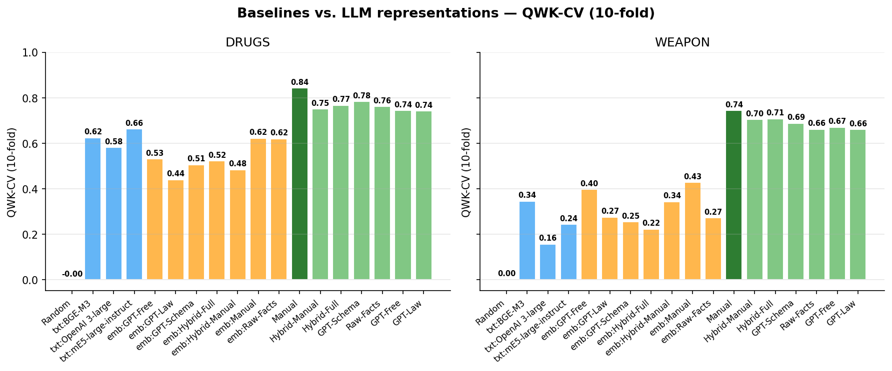
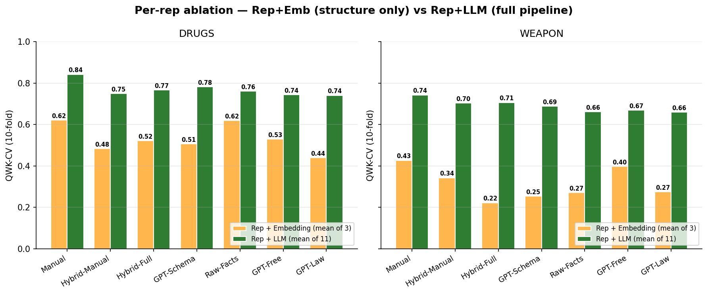

# Baselines — Paper-ready Report

_Compares several layers for each (domain, metric):_

_  1. **Random null** — 1000 GT-shuffles per cell (advisor's method). Preserves class proportions exactly._
_  2. **Embedding-Text** — cosine similarity of full verdict-text embeddings (OpenAI 3-large, mE5-large-instruct, BGE-M3). Non-structured baseline._
_  3. **Emb-on-rep** — embedding of the rep's *structured feature vector* + cosine. Isolates structure vs. LLM reasoning contributions._
_  4. **LLM-rep** — main experiment: rep + LLM scoring (mean across 11 models)._

## 1. Headline comparison — mean across aggregation

### DRUGS

| category                           |   F1-Oracle (b0 strict) |   F1-Oracle (b1 lenient) |   F1-CV (b0 strict) |   F1-CV (b1 lenient) |   AP-PR (b0 strict) |   AP-PR (b1 lenient) |   QWK-Oracle |   QWK-CV (10-fold) |
|:-----------------------------------|------------------------:|-------------------------:|--------------------:|---------------------:|--------------------:|---------------------:|-------------:|-------------------:|
| Random (null mean)                 |                   0.358 |                    0.48  |               0.357 |                0.484 |               0.368 |                0.515 |       -0.002 |             -0.001 |
| Embedding-Text: BGE-M3             |                   0.817 |                    0.796 |               0.75  |                0.757 |               0.825 |                0.847 |        0.692 |              0.623 |
| Embedding-Text: OpenAI 3-large     |                   0.743 |                    0.725 |               0.725 |                0.667 |               0.705 |                0.788 |        0.598 |              0.581 |
| Embedding-Text: mE5-large-instruct |                   0.816 |                    0.796 |               0.779 |                0.75  |               0.788 |                0.837 |        0.712 |              0.662 |
| Emb-on-GPT-Free: mean              |                   0.749 |                    0.777 |               0.704 |                0.746 |               0.717 |                0.776 |        0.615 |              0.53  |
| Emb-on-GPT-Law: mean               |                   0.68  |                    0.751 |               0.616 |                0.734 |               0.679 |                0.77  |        0.539 |              0.439 |
| Emb-on-GPT-Schema: mean            |                   0.699 |                    0.714 |               0.618 |                0.677 |               0.792 |                0.813 |        0.58  |              0.506 |
| Emb-on-Hybrid-Full: mean           |                   0.765 |                    0.752 |               0.737 |                0.711 |               0.768 |                0.79  |        0.617 |              0.522 |
| Emb-on-Hybrid-Manual: mean         |                   0.75  |                    0.751 |               0.715 |                0.716 |               0.697 |                0.79  |        0.592 |              0.483 |
| Emb-on-Manual: mean                |                   0.776 |                    0.812 |               0.74  |                0.745 |               0.83  |                0.856 |        0.709 |              0.622 |
| Emb-on-Raw-Facts: mean             |                   0.792 |                    0.773 |               0.751 |                0.733 |               0.773 |                0.824 |        0.667 |              0.62  |
| LLM-rep: Manual                    |                   0.912 |                    0.849 |               0.894 |                0.835 |               0.956 |                0.917 |        0.859 |              0.843 |
| LLM-rep: Hybrid-Manual             |                   0.88  |                    0.822 |               0.857 |                0.788 |               0.93  |                0.895 |        0.804 |              0.75  |
| LLM-rep: Hybrid-Full               |                   0.892 |                    0.821 |               0.874 |                0.79  |               0.92  |                0.88  |        0.808 |              0.767 |
| LLM-rep: GPT-Schema                |                   0.868 |                    0.835 |               0.842 |                0.818 |               0.936 |                0.9   |        0.823 |              0.783 |
| LLM-rep: Raw-Facts                 |                   0.874 |                    0.815 |               0.841 |                0.79  |               0.903 |                0.869 |        0.795 |              0.761 |
| LLM-rep: GPT-Free                  |                   0.878 |                    0.81  |               0.855 |                0.774 |               0.904 |                0.871 |        0.787 |              0.744 |
| LLM-rep: GPT-Law                   |                   0.867 |                    0.798 |               0.853 |                0.764 |               0.89  |                0.861 |        0.773 |              0.741 |

### WEAPON

| category                           |   F1-Oracle (b0 strict) |   F1-Oracle (b1 lenient) |   F1-CV (b0 strict) |   F1-CV (b1 lenient) |   AP-PR (b0 strict) |   AP-PR (b1 lenient) |   QWK-Oracle |   QWK-CV (10-fold) |
|:-----------------------------------|------------------------:|-------------------------:|--------------------:|---------------------:|--------------------:|---------------------:|-------------:|-------------------:|
| Random (null mean)                 |                   0.354 |                    0.481 |               0.355 |                0.478 |               0.344 |                0.474 |        0.001 |              0.001 |
| Embedding-Text: BGE-M3             |                   0.591 |                    0.717 |               0.496 |                0.694 |               0.606 |                0.703 |        0.455 |              0.345 |
| Embedding-Text: OpenAI 3-large     |                   0.532 |                    0.64  |               0.477 |                0.584 |               0.495 |                0.6   |        0.293 |              0.157 |
| Embedding-Text: mE5-large-instruct |                   0.603 |                    0.686 |               0.565 |                0.648 |               0.542 |                0.686 |        0.403 |              0.243 |
| Emb-on-GPT-Free: mean              |                   0.626 |                    0.716 |               0.556 |                0.688 |               0.54  |                0.674 |        0.465 |              0.397 |
| Emb-on-GPT-Law: mean               |                   0.6   |                    0.701 |               0.572 |                0.675 |               0.555 |                0.689 |        0.408 |              0.274 |
| Emb-on-GPT-Schema: mean            |                   0.555 |                    0.656 |               0.492 |                0.613 |               0.521 |                0.66  |        0.344 |              0.253 |
| Emb-on-Hybrid-Full: mean           |                   0.557 |                    0.674 |               0.529 |                0.649 |               0.521 |                0.639 |        0.337 |              0.222 |
| Emb-on-Hybrid-Manual: mean         |                   0.602 |                    0.683 |               0.561 |                0.648 |               0.48  |                0.651 |        0.4   |              0.343 |
| Emb-on-Manual: mean                |                   0.634 |                    0.718 |               0.566 |                0.681 |               0.672 |                0.751 |        0.521 |              0.427 |
| Emb-on-Raw-Facts: mean             |                   0.577 |                    0.682 |               0.524 |                0.645 |               0.548 |                0.663 |        0.387 |              0.271 |
| LLM-rep: Manual                    |                   0.787 |                    0.846 |               0.766 |                0.828 |               0.827 |                0.898 |        0.763 |              0.743 |
| LLM-rep: Hybrid-Manual             |                   0.763 |                    0.828 |               0.729 |                0.805 |               0.803 |                0.876 |        0.734 |              0.704 |
| LLM-rep: Hybrid-Full               |                   0.763 |                    0.835 |               0.742 |                0.821 |               0.783 |                0.885 |        0.74  |              0.707 |
| LLM-rep: GPT-Schema                |                   0.759 |                    0.82  |               0.737 |                0.801 |               0.807 |                0.879 |        0.726 |              0.688 |
| LLM-rep: Raw-Facts                 |                   0.744 |                    0.805 |               0.721 |                0.785 |               0.741 |                0.846 |        0.69  |              0.661 |
| LLM-rep: GPT-Free                  |                   0.736 |                    0.806 |               0.702 |                0.785 |               0.733 |                0.864 |        0.695 |              0.67  |
| LLM-rep: GPT-Law                   |                   0.736 |                    0.813 |               0.712 |                0.793 |               0.733 |                0.847 |        0.692 |              0.66  |

## 2. Ablation — Rep+LLM vs. Rep+Embedding (QWK-CV)

_Gap isolates the contribution of LLM reasoning on top of a given structured representation._

### DRUGS

| rep           |   LLM_avg |   Emb_avg |   Gap |
|:--------------|----------:|----------:|------:|
| Manual        |     0.843 |     0.622 | 0.221 |
| Hybrid-Manual |     0.75  |     0.483 | 0.268 |
| Hybrid-Full   |     0.767 |     0.522 | 0.245 |
| GPT-Schema    |     0.783 |     0.506 | 0.277 |
| Raw-Facts     |     0.761 |     0.62  | 0.141 |
| GPT-Free      |     0.744 |     0.53  | 0.213 |
| GPT-Law       |     0.741 |     0.439 | 0.302 |

### WEAPON

| rep           |   LLM_avg |   Emb_avg |   Gap |
|:--------------|----------:|----------:|------:|
| Manual        |     0.743 |     0.427 | 0.316 |
| Hybrid-Manual |     0.704 |     0.343 | 0.362 |
| Hybrid-Full   |     0.707 |     0.222 | 0.485 |
| GPT-Schema    |     0.688 |     0.253 | 0.435 |
| Raw-Facts     |     0.661 |     0.271 | 0.39  |
| GPT-Free      |     0.67  |     0.397 | 0.273 |
| GPT-Law       |     0.66  |     0.274 | 0.386 |

## 3. Fraction of cells where LLM-rep beats 97.5% null CI-hi

|                             |   F1-Oracle (b0 strict) |   F1-Oracle (b1 lenient) |   F1-CV (b0 strict) |   F1-CV (b1 lenient) |   AP-PR (b0 strict) |   AP-PR (b1 lenient) |   QWK-Oracle |   QWK-CV (10-fold) |
|:----------------------------|------------------------:|-------------------------:|--------------------:|---------------------:|--------------------:|---------------------:|-------------:|-------------------:|
| ('drugs', 'GPT-Free')       |                       1 |                        1 |                   1 |                    1 |                   1 |                    1 |            1 |                  1 |
| ('drugs', 'GPT-Law')        |                       1 |                        1 |                   1 |                    1 |                   1 |                    1 |            1 |                  1 |
| ('drugs', 'GPT-Schema')     |                       1 |                        1 |                   1 |                    1 |                   1 |                    1 |            1 |                  1 |
| ('drugs', 'Hybrid-Full')    |                       1 |                        1 |                   1 |                    1 |                   1 |                    1 |            1 |                  1 |
| ('drugs', 'Hybrid-Manual')  |                       1 |                        1 |                   1 |                    1 |                   1 |                    1 |            1 |                  1 |
| ('drugs', 'Manual')         |                       1 |                        1 |                   1 |                    1 |                   1 |                    1 |            1 |                  1 |
| ('drugs', 'Raw-Facts')      |                       1 |                        1 |                   1 |                    1 |                   1 |                    1 |            1 |                  1 |
| ('weapon', 'GPT-Free')      |                       1 |                        1 |                   1 |                    1 |                   1 |                    1 |            1 |                  1 |
| ('weapon', 'GPT-Law')       |                       1 |                        1 |                   1 |                    1 |                   1 |                    1 |            1 |                  1 |
| ('weapon', 'GPT-Schema')    |                       1 |                        1 |                   1 |                    1 |                   1 |                    1 |            1 |                  1 |
| ('weapon', 'Hybrid-Full')   |                       1 |                        1 |                   1 |                    1 |                   1 |                    1 |            1 |                  1 |
| ('weapon', 'Hybrid-Manual') |                       1 |                        1 |                   1 |                    1 |                   1 |                    1 |            1 |                  1 |
| ('weapon', 'Manual')        |                       1 |                        1 |                   1 |                    1 |                   1 |                    1 |            1 |                  1 |
| ('weapon', 'Raw-Facts')     |                       1 |                        1 |                   1 |                    1 |                   1 |                    1 |            1 |                  1 |

